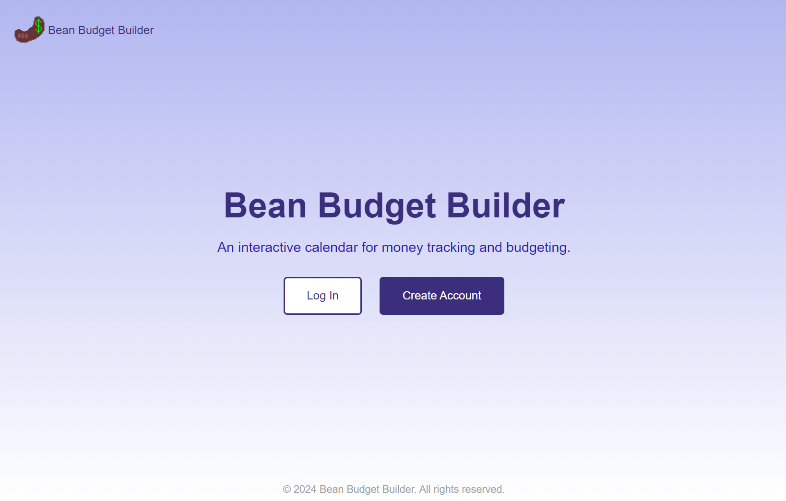
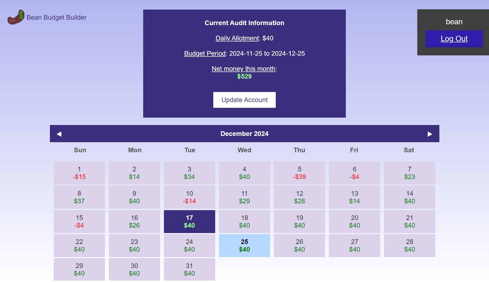

# Bean Budget Builder

## Overview

A website for tracking one's finances.

Specifically, a day-to-day budget with the storing of expendatures, and calculations in regards to
how one's spending is fitting into their budget. Primarily accessed by a calendar view with edit
options and an audit report.

Written in Rust: Actix server, SQLite storage and Argon2 encryption.

## Screenshots

## Configuration

Any necessary changes should be done to the root folder's `settings.toml` file, based on one's setup needs.

After that, standard Rust tools with Cargo should work: `cargo run` and go to the relevant hosted address in a browser.

## Public Usage

As of writing, I am hosting on an AWS instance at http://budget.benjaminmassey.com/

## Contact

Email benjamin.w.massey@gmail.com for any questions or inquiries.